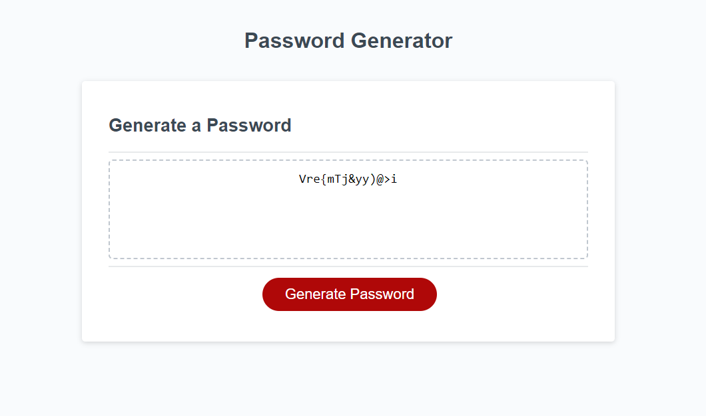

# Random Password Generator

This password generator gives the user the options on how their randomly generated password will look like. 

## Password Options 

* 8-128 Characters
* Uppercase Characters
* Lowercase Characters
* Numeric Characters
* Special Characters 

## Deployment

To deploy this project follow this url: https://cody-and.github.io/password-generator-03/

## FAQ

#### What happens if I input a number <8 and >128?

The password will be automatically set to 8 characters.

#### What happens if I choose cancel for uppercase, lowercase, numeric, and special characters?

The password will automatically generate with lowercase characters only.

## Screenshots

